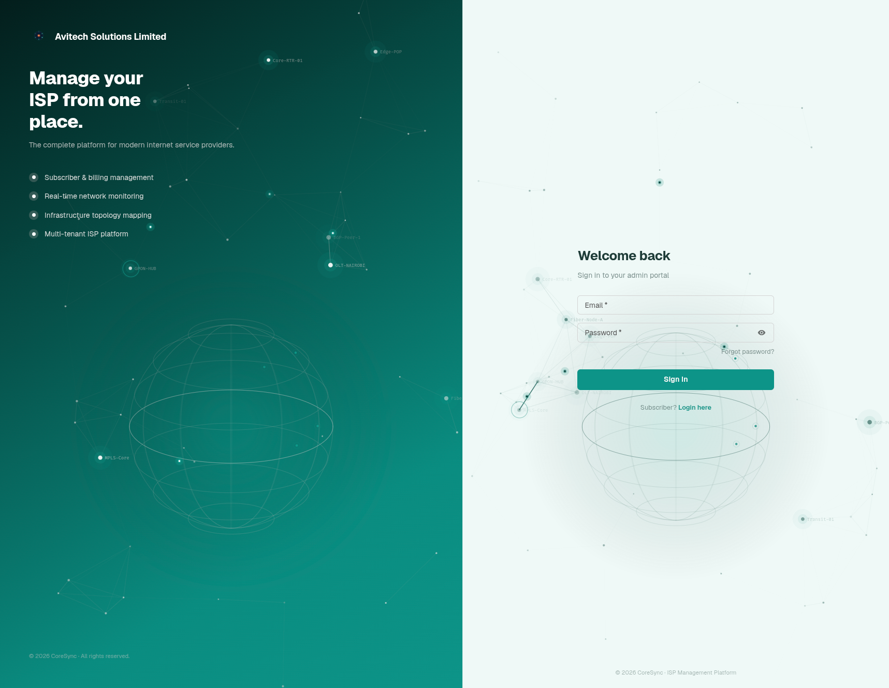
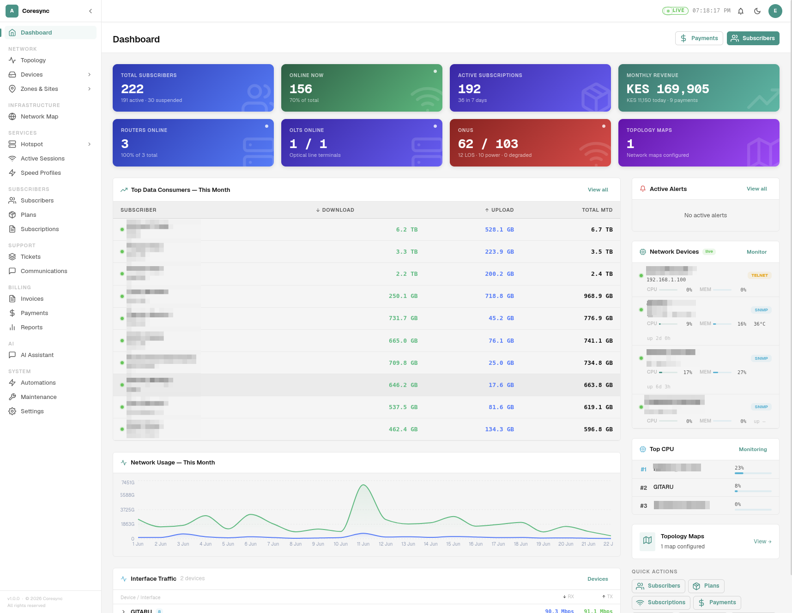

# Logging In

## Accessing the Portal

Open your browser and go to your CoreSync portal URL. You will see the login page.

## Login

| Field | What to enter |
|---|---|
| Email / Username | The email address or username assigned to your account |
| Password | Your account password |

Click **Sign In**.

!!! tip "Forgot your password?"
    Click **Forgot Password** on the login page. A reset link will be sent to your email.

## The Dashboard

After logging in, you land on the **Dashboard**. It gives you a live summary of the system:

- **Active subscribers** — count and online/offline breakdown
- **Revenue overview** — today's collections, monthly recurring revenue
- **Recent payments** — latest transactions across all payment methods
- **Device status** — routers and NAS devices that are up or down
- **Open tickets** — unresolved support tickets requiring attention

## First-Time Setup

If you are setting up the portal for a new tenant, see the [Setup Guide](setup.md) for a step-by-step walkthrough covering speed profiles, zones, devices, IP pools, service plans, and importing subscribers.

!!! note "Role-Based Access"
    What you see depends on your assigned role. If a section is missing, contact your system administrator.
